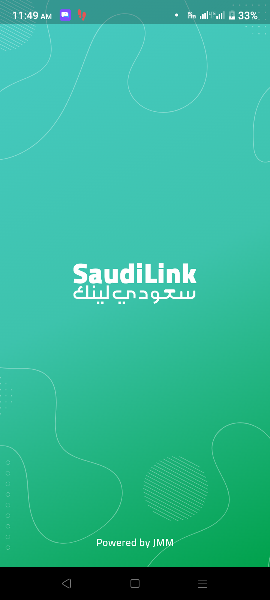
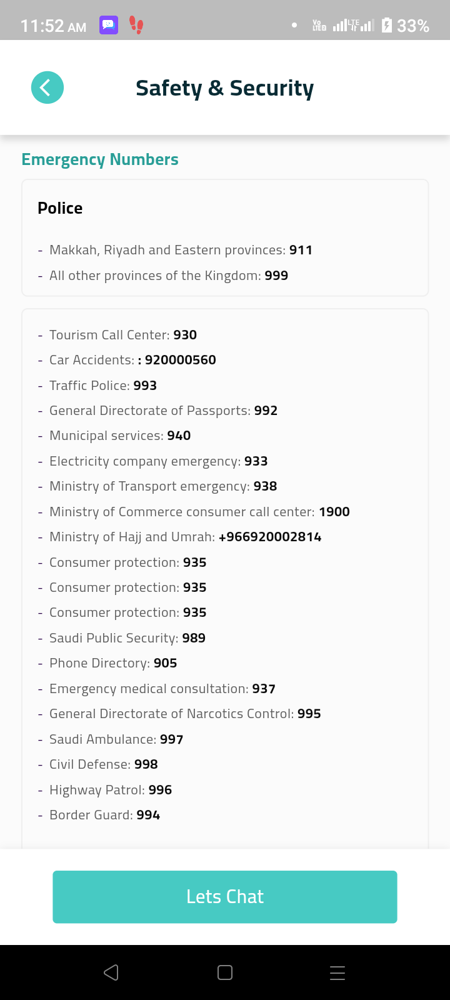

# Saudi-Guide
INTRODUCTION

Saudi Guide is an advanced and technology-enabled app that combines a range of cutting-edge features using Cohere & Stable Diffusion to provide an exceptional travel experience for visitors exploring the Kingdom of Saudi Arabia.

KEY FEATURES:

1. Enhanced Convenience: Traveling in Saudi Arabia has never been easier. Saudi Guide streamlines your journey, allowing you to focus on creating lasting memories.
2. Safety and Security: With real-time navigation and local insights, you can explore confidently, knowing you have a reliable travel companion by your side.
3. Rich Cultural Experience: Dive into the heart of Saudi culture and history with interactive AR experiences and expertly curated content.
4. Global Accessibility: Saudi Guide welcomes travelers from all corners of the world, breaking down language barriers and making Saudi Arabia more accessible than ever.

TECHNOLOGIES & TOOLS USED

1. Open ai gpt 3.5 turbo
2. Speech Recognition
3. Realtime weather
4. Text Recognition
5. Stable diffusion (Text to image)
6. Flutter
7. Firebase

SCREENSHOTS

                  
